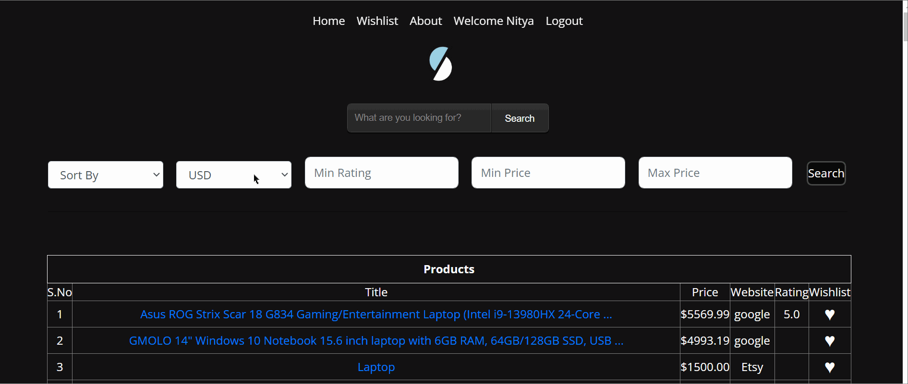
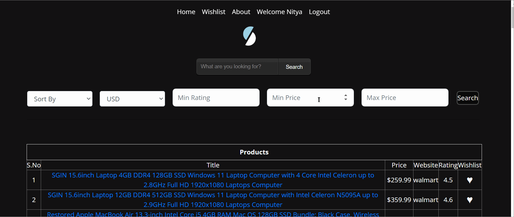
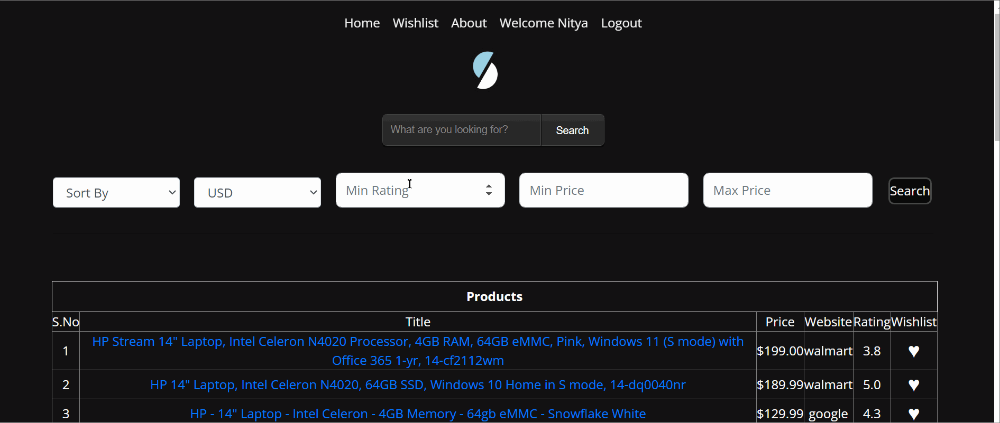
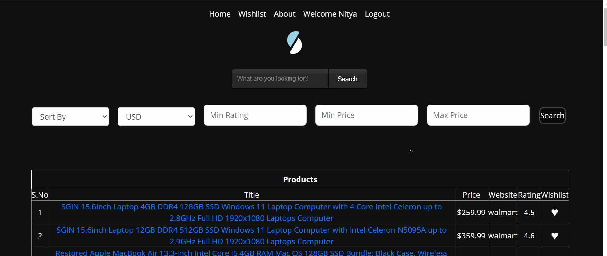
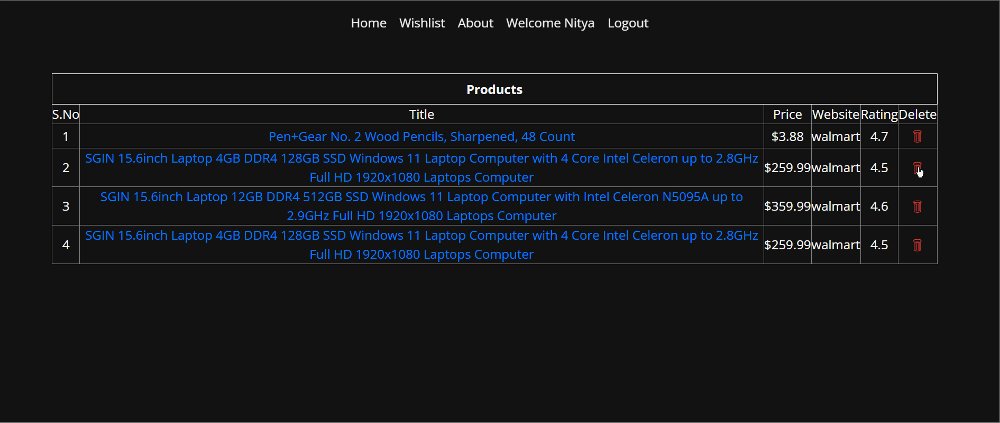
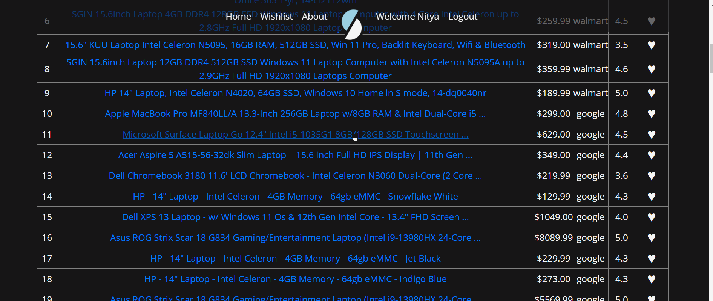

# Slash
Scrapes the most popular e-commerce websites to get the best deals on searched items across these websites. 
- **Fast**: With Slash, you can save over 50% of your time by comparing deals across websites within seconds
- **Easy**: Slash uses very easy commands to filter, sort and search your items

# :rocket: Quick Guide

1. Access the Github repository from your computer. 
 - First, pre-install [git](https://git-scm.com/) on  your machine. 
 - Then, clone the repo using the following command:
 ```
 git clone https://github.com/Dedeepyapnv/Slash
 ```
 * Finally, ```cd``` into the local repository.
```
cd Slash
```
2. Install the ```requirements.txt```. 
- This project uses Python 3, so make sure that [Python](https://www.python.org/downloads/) and [Pip](https://pip.pypa.io/en/stable/installation/) are preinstalled.
- Install the ```requirements.txt``` file using pip.
```
pip3 install -r requirements.txt
```
3. Running the program

- Set the environmental variable using either of the following commands:
 ```
MAC
export FLASK_APP=./src/modules/app
flask run

Windows Command Prompt
set FLASK_APP=.\src\modules\app 
flask run

Windows Powershell
$Env:FLASK_APP='.\src\modules\app'
flask run
```

4. Once flask is running, open your internet browser and type ```http://127.0.0.1:5000/``` into the search bar.

<p>
 
# :dizzy: What's New ?

### User Interface: Login 
<p> You can have your own account. You can store their data and can access the data whenever required. </p>
<p> In previous version most of the feautures are in command line which we changed every feauture to User Interface. </p>
<p align="center"></p>

### Sorting
<p> You can sort the products based on rating or price.  </p>
<p align="center"></p>

### Currency
<p> View prices in the currency of your choice. </p>
<p align="center"></p>

### Filtering
<p> Based on Min Price and Max Price you can filter your data.</p>
<p align="center"></p>

### Filtering
<p> Filter the data using Minimum Rating.</p>
<p align="center"></p>

### Wishlist
<p> You can add Your favorite product to Wishlist.</p>
<p align="center"></p>

### Delete
<p>Remove selected product from your wishlist.</p>
<p align="center"></p>

### Product Link
<p> Product Link which directs to the product page.</p>
<p align="center"></p>


